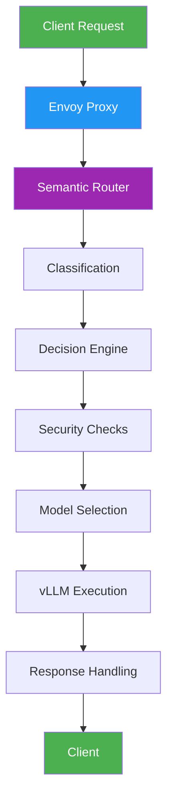
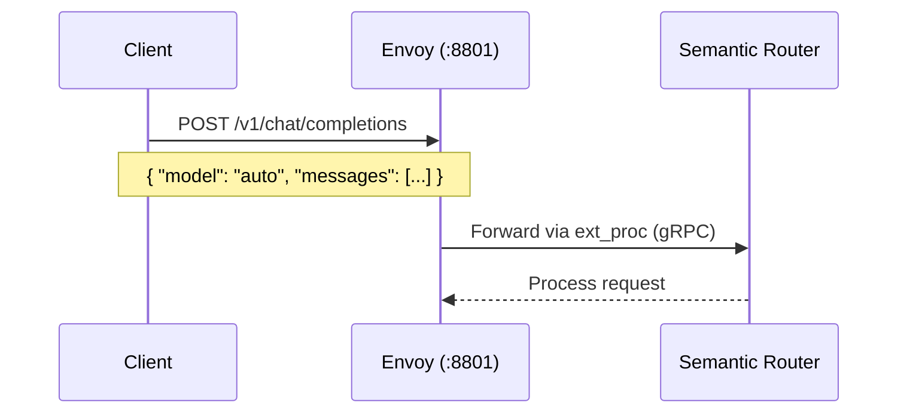
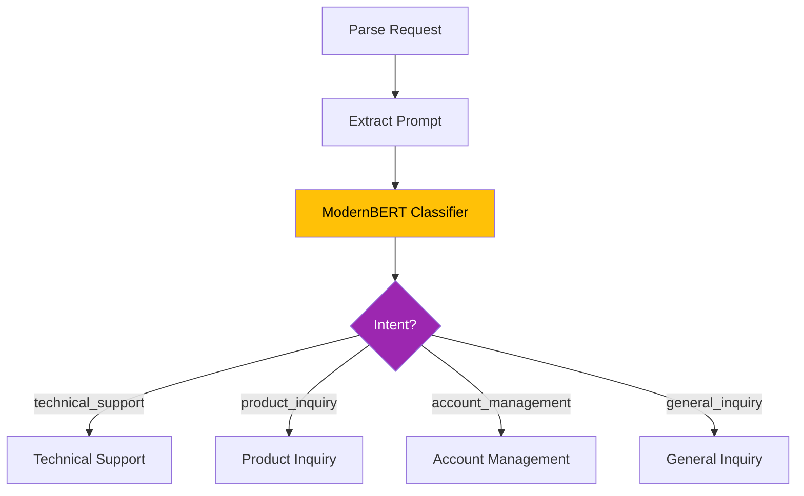
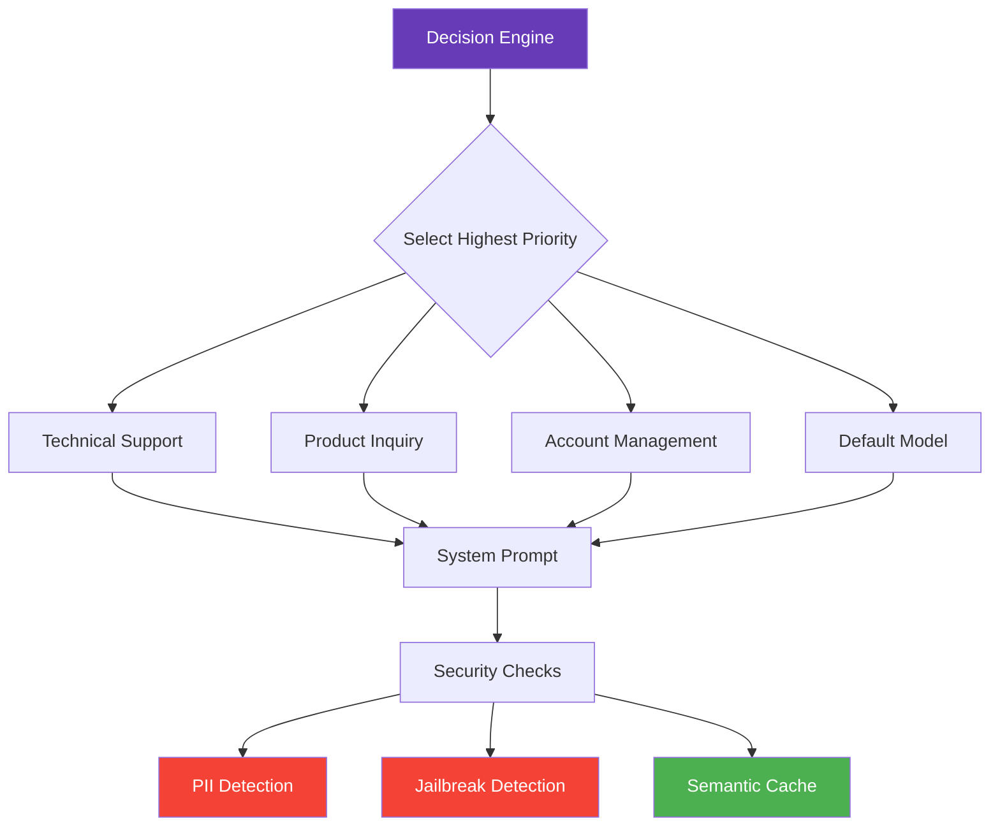
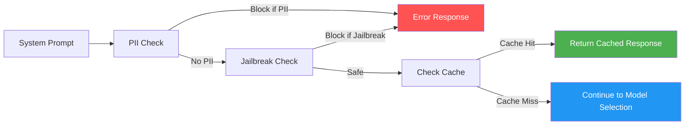
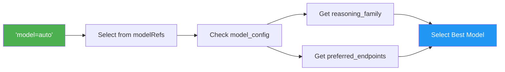
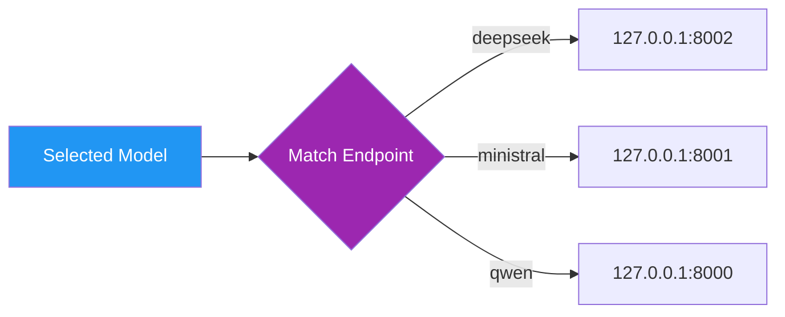
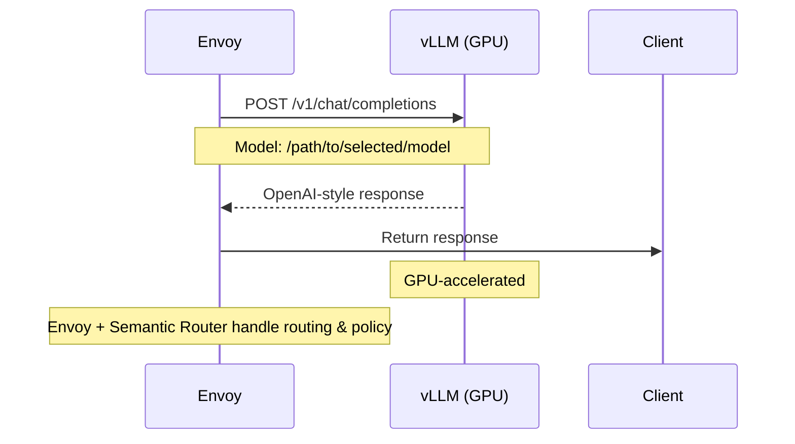
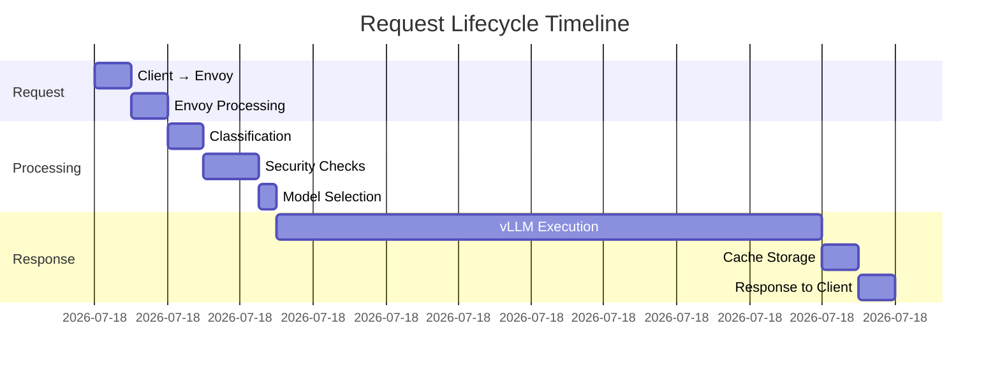

# 🚀 vLLM Semantic Router: Request Flow

This document visualizes the complete request lifecycle, from initial client request to final response, including intelligent routing, security checks, and model selection.

## 🔄 Request Lifecycle

## 1️⃣ Client Request → Envoy Proxy

## 2️⃣ Request Processing Pipeline

### Classification & Routing

**Classification Process**:
- ModernBERT analyzes the prompt
- Matches against predefined categories
- Logs: `[CLASS] matched rule "technical_support"`

        ↓

## 3️⃣ Decision Engine & Security Layer

### Decision Flow

### Security & Caching Pipeline

**Security Features**:
- **PII Detection**: Blocks sensitive data exposure
- **Jailbreak Protection**: Prevents prompt injection
- **Semantic Caching**: Improves response time for similar queries

        ↓ (cache miss, no block)

## 4️⃣ Model & Endpoint Selection

### Auto Model Selection

### Endpoint Routing

## 5️⃣ Execution & Response

### vLLM Processing

### Response Flow

## 🌐 Client Perspective

From the application's point of view:

**Key Benefits**:
- Simplified client integration (just use `model: "auto"`)
- Automatic optimization of model selection
- Built-in security and caching
- Transparent routing logic
